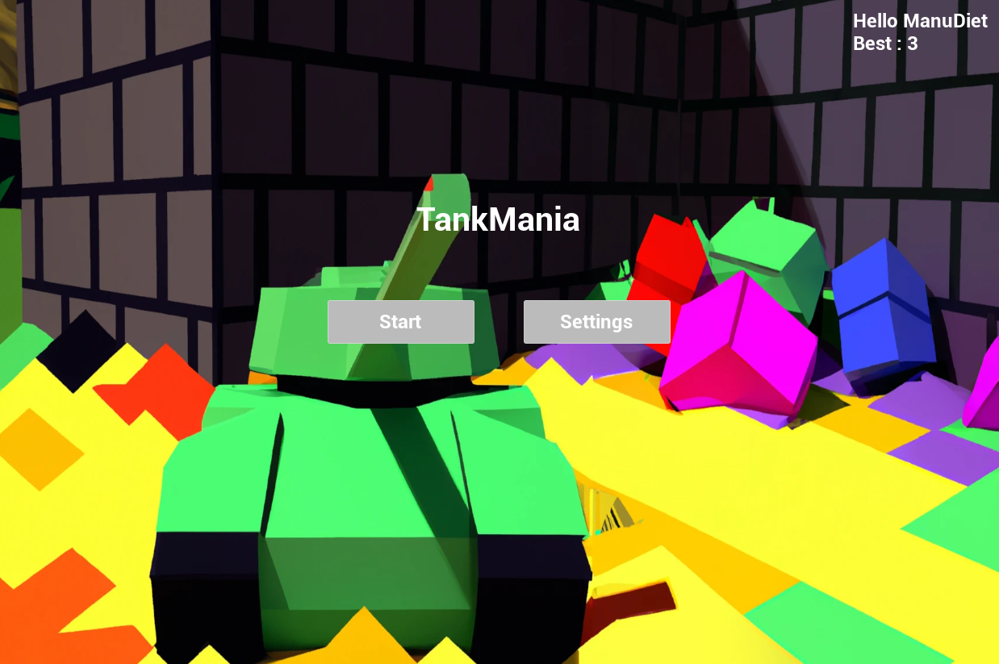
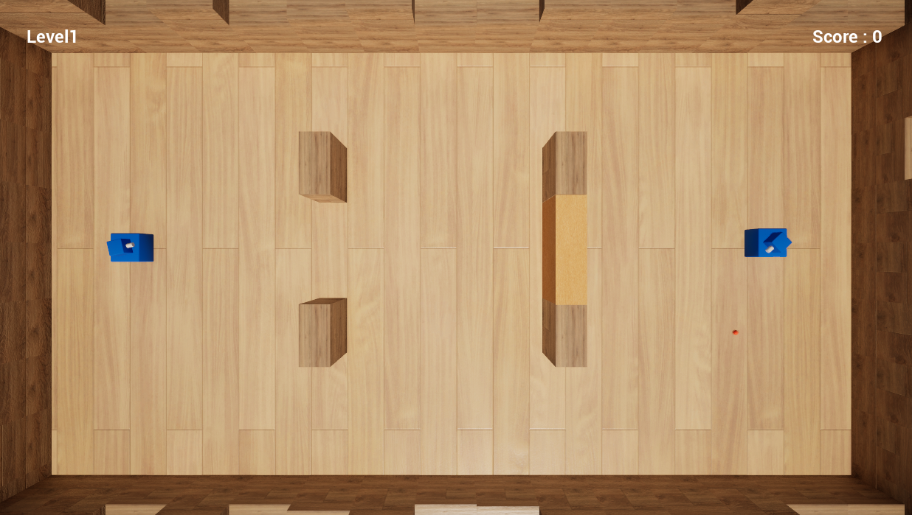

## TankMania

Ce projet a pour but de recréer en partie le [mini-jeu de tanks](https://www.youtube.com/watch?v=orLxrg51xL8&t=4s) disponible sur le jeu "Wii Sports".

J'effectue ce projet afin d'apprendre à utiliser le moteur de jeu *Unreal Engine* ainsi que pour améliorer mes compétences en C++.

Vous pouvez retrouver une version téléchargeable du jeu [ici](https://manudiet.itch.io/tankmania).

------

## Outils

Le jeu est développé via le moteur de jeu **Unreal Engine**. 

Les différents comportement sont implémentés principalement avec des classes C++, mais les *Blueprints* sont également utilisés.

Le [wiki](https://nintendo.fandom.com/wiki/Tanks!) relatif à ce mini-jeu est également utilisé afin d'avoir les informations relatives aux comportements des différents tanks ennemis.

------

## Principe

L'objectif du jeu est de parvenir à détruire tous les tanks ennemis dans un niveau, afin de parvenir au niveau suivant. Lorsque le joueur parvient à finir le dernier niveau, il remporte alors la victoire et peut retourner au menu.

Le joueur dispose de deux armes :
- Le canon, qui lui permet de tirer un certain nombre de projectiles qui peuvent rebondir sur les murs un certain nombre de fois. Lorsqu'un projectile rentre en contact avec un tank, le tank est détruit.
- La mine, qu'il peut placer au sol. Au bout d'un certain temps, la mine explose, détruisant tanks et murs destructibles à proximité.

Pour observer le fonctionnement du mini-jeu original, vous pouvez vous référer à la vidéo [ici](https://www.youtube.com/watch?v=orLxrg51xL8?si=tM9QWwh8257nQhhK)
